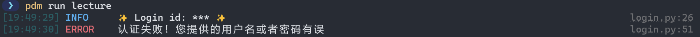
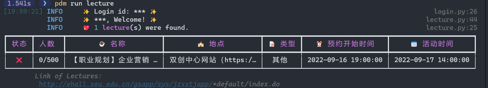
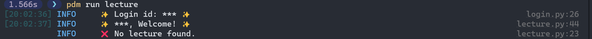

# SEU Lecture Monitor

自动登录并检查讲座状态，不依赖浏览器/webdriver。

开发环境：python 3.8 (理论上 >= 3.7 即可), 项目采用 [PDM - Python Development Master](https://pdm.fming.dev/) 管理。

## 使用指南

1. 克隆项目到本地并进入项目目录
2. 重命名 `.env.example` 为 `.env`，修改内容为你的账号和密码
3. 如果你:
    - 使用 `pdm`：
        1. 安装依赖：`pdm install`
        2. 在目录下执行 `pdm run lecture`
        3. 如果有想要选取的讲座，执行 `pdm run web` 将打开浏览器并跳转到讲座网页，可能需要登录
    - 使用 pip/conda/mamba：
        1. 使用你的包管理器安装依赖：`pip install requests js2py pyquery environs rich`
        2. 在目录下执行 `python ./src/lecture.py`
        3. 如果有想要选取的讲座，执行 `python ./src/call_browser.py` 将打开浏览器并跳转到讲座网页，可能需要登录
4. 或者复制执行结果底部提供的链接并在浏览器中访问

## 截图

- 登陆失败时

- 成功获取到讲座

- 没有获取到讲座

## 声明

**⚠️项目是出于学习目的编写的，仅能获取讲座状态，不具备预约讲座功能⚠️**

## 特别感谢

- 模拟登录代码修改自 [luzy99/SEUAutoLogin: 东南大学信息门户自动登录，SEU每日自动健康打卡，附赠绩点计算功能。Github Action一键部署，自动打卡](https://github.com/luzy99/SEUAutoLogin)